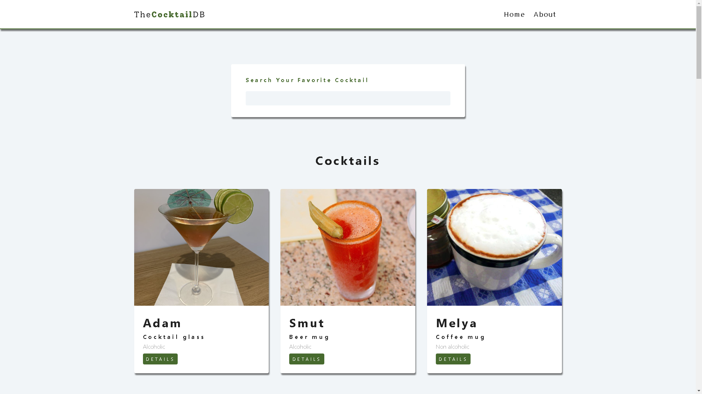

<div id="top"></div>


<!-- PROJECT LOGO -->
<div align="center">
  <h2 align="center">Cocktail</h2>
</div>

<!-- TABLE OF CONTENTS -->
<details>
  <summary>Table of Contents</summary>
  <ol>
    <li>
      <a href="#overview">Overview</a>
      <ul>
        <li><a href="#stack">Stack</a></li>
      </ul>
    </li>
    <li>
      <a href="#getting-started">Getting Started</a>
      <ul>
        <li><a href="#installation">Installation</a></li>
      </ul>
    </li>
    <li><a href="#liveDemo">live Demo</a></li>
  </ol>
</details>

<!-- ABOUT THE PROJECT -->

## Overview

In this project, Implemented a search engine through cocktail API. using react/router, fetching and displaying cocktail by user demand.

## Stack

- React.js
- React.Router
- Custom hooks
- advanced folder structure

---

<!-- GETTING STARTED -->

## Getting Started

This project require some prequesites and dependenscies to be installed, you can find the instructions below

> To get Started, follow these simple steps :

## Installation

1. Clone the repo

2. go to project folder

3. install dependencies

   ```bash
   npm i
   npm i react-router-dom
   npm run dev
   ```

## liveDemo

[](https://silver-cocktails-react-app.netlify.app/)

## Screenshots

### Preview Image



<p align="right">(<a href="#top">back to top</a>)</p>
